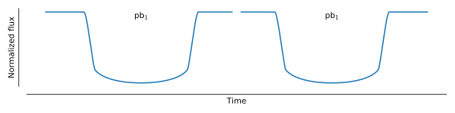
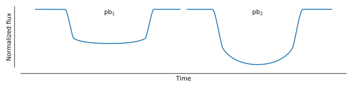
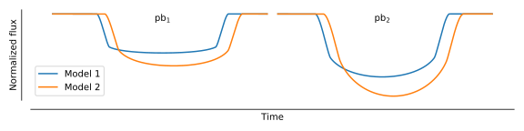

PyTransit
=========

[](https://travis-ci.org/hpparvi/PyTransit)
[](https://pytransit.readthedocs.io/en/latest/?badge=latest)
[](https://codecov.io/gh/hpparvi/PyTransit)
[](http://www.gnu.org/licenses/gpl-2.0.html)
[](http://mnras.oxfordjournals.org/content/450/3/3233)
[](http://arxiv.org/abs/1504.07433)
[](http://ascl.net/1505.024)
[](https://zenodo.org/badge/latestdoi/5871/hpparvi/PyTransit)

Fast and easy-to-use tools for exoplanet transit light curve modelling with Python. PyTransit offers optimised CPU and 
GPU implementations of popular exoplanet transit models with a unified interface, and thrives to be *the fastest and the 
most versatile* tool for transit modelling in Python. 

PyTransit makes transit model evaluation trivial whether modelling straightforward single-passband transit light curves or
more complex science-cases, such as transmission spectroscopy. Further, the model can be evaluated for a large set of
parameter sets simultaneously in parallel to optimize the evaluation speed with population-based MCMC samplers and 
optimization methods, such as emcee and  DE-MCMC.

```Python
from pytransit import QuadraticModel

tm = QuadraticModel()
tm.set_data(times)

tm.evaluate(k=0.1, ldc=[0.2, 0.1], t0=0.0, p=1.0, a=3.0, i=0.5*pi)

tm.evaluate(k=[0.10, 0.12], ldc=[[0.2, 0.1, 0.5, 0.1]], t0=0.0, p=1.0, a=3.0, i=0.5*pi)

tm.evaluate(k=[[0.10, 0.12], [0.11, 0.13]], ldc=[[0.2, 0.1, 0.5, 0.1],[0.4, 0.2, 0.75, 0.1]],
            t0=[0.0, 0.01], p=[1, 1], a=[3.0, 2.9], i=[.5*pi, .5*pi])
```





The package has been used in research since 2010, and is described in [Parviainen (2015)](http://arxiv.org/abs/1504.07433), which also details the model-specific optimisations and model performance.

## Documentation

Read the docs at [pytransit.readthedocs.io](https://pytransit.readthedocs.io).

## News

- **5.4.2020:** The log likelihood and baseline computation has been changed completely for log posterior functions. 
 The changes make creating complex models combining different noise models easy to implement, but also will break old
 code... Please use the *old_lnlike_and_baseline* branch if your code is broken by the changes, and change to the new 
 approach when feasible. The required changes are small and relatively painless.

## Examples and tutorials

- [TESS transit modelling example](https://github.com/hpparvi/PyTransit/blob/master/notebooks/tess_examples/WASP-4b.ipynb) 
  that reproduces the WASP-4b analysis by [Bouma et al. (2019)](http://adsabs.harvard.edu/abs/2019AJ....157..217B).

- [Third light contamination analysis examples](https://github.com/hpparvi/PyTransit/tree/master/notebooks/contamination)
  illustrate the use of the contamination module in transiting planet candidate validation with multicolour photometry, 
  as detailed in [Parviainen et al. (A&A, 2019)](https://www.aanda.org/articles/aa/pdf/2019/10/aa35709-19.pdf), and used 
  in [Parviainen et al. (A&A, 2020)](https://www.aanda.org/articles/aa/pdf/2020/01/aa35958-19.pdf).

## What's new in PyTransit v2.0 beta (2020)

**Freedom from Fortran**
- PyTransit v2.0 replaces all the old Fortran code with numba-accelerated Python versions!

**Mature OpenCL implementations**
- The OpenCL versions of the models are now mature, and can be swapped with the Numba-accelerated Python versions 
  without modifications.
- The OpenCL implementations evaluated in a GPU can offer 10-20 x acceleration compared to the Python versions. 
- Simultaneous model computation for a set of parameter vectors accelerates population-based sampling and optimisation methods, 
  such as *Affine Invariant Sampling (emcee)* and *Differential Evolution*.

**Two new transit models**
- Power-2 transit model by [Maxted & Gill (A&A 622, A33 2019)](https://www.aanda.org/10.1051/0004-6361/201834563).
- Optically thin shell model by [Schlawin et al. (ApJL 722, 75--79, 2010)](http://adsabs.harvard.edu/abs/2010ApJ...722L..75S)
  to model a transit over a chromosphere.

**Flux contamination module**
- Introduced a physics-based module to model flux contamination (blending).
- Detailed in Parviainen et al.  (a, submitted, 2019), and used in Parviainen et al. (b, in prep. 2019)

**Example notebooks**
- All (well, most of, but this'll be improved) the functionality is now documented in Jupyter notebooks available in
 [GitHub](https://github.com/hpparvi/PyTransit/tree/master/notebooks).
- TESS modelling examples using `pytransit.lpf.TESSLPF`.

**Lop posterior function (LPF) classes**
- The `pytransit.lpf` (LogPosteriorFunction) module contains classes that can be used directly to carry out Bayesian 
transit analyses. They can also be used as a starting point for more complex models, and have been written to be easily 
extendable.

## Features

**Transit models**
  - Series-expansion based transit model by [A. Gimenez (A&A 450, 1231--1237, 2006)](http://adsabs.harvard.edu/abs/2006A&A...450.1231G).
  - Quadratic limb-darkening transit model by [Mandel & Agol (ApJ 580, L171–L175, 2002)](http://adsabs.harvard.edu/abs/2002ApJ...580L.171M).
  - Uniform disk transit model by [Mandel & Agol (ApJ 580, L171–L175, 2002)](http://adsabs.harvard.edu/abs/2002ApJ...580L.171M).
  - Power-2 transit model by [Maxted & Gill](ArXiv:1812.01606).
  - Optically thin shell model by [Schlawin et al. (ApJL 722, 75--79, 2010)](http://adsabs.harvard.edu/abs/2010ApJ...722L..75S) to model narrow-band transits observations of chromospheric emission lines.

**Common features**
  - Efficient model evaluation for multicolour observations and transmission spectroscopy.
  - Built-in model interpolation for the modelling of large datasets.
  - Built-in supersampling to account for extended exposure times.

**Utilities**
  - Routines to calculate the projected planet-to-star distance for circular and eccentric orbits.
  - Routines to calculate transit durations, etc.

Installation
------------


### GitHub

Clone the repository from github and do the normal python package installation

    git clone https://github.com/hpparvi/PyTransit.git
    cd PyTransit
    python setup.py install


Citing
------

If you use PyTransit in your reserach, please cite

Parviainen, H. MNRAS 450, 3233–3238 (2015) (DOI:10.1093/mnras/stv894).

or use this ready-made BibTeX entry

    @article{Parviainen2015,
      author = {Parviainen, Hannu},
      doi = {10.1093/mnras/stv894},
      journal = {MNRAS},
      number = {April},
      pages = {3233--3238},
      title = {{PYTRANSIT: fast and easy exoplanet transit modelling in PYTHON}},
      url = {http://mnras.oxfordjournals.org/cgi/doi/10.1093/mnras/stv894},
      volume = {450},
      year = {2015}
    }


Notes
-----

 - The interpolated (quadratic) Mandel & Agol model offers the best performance at the moment, but needs to be initialised with the minimum and maximum allowed radius ratio.  
 - Please use the [Issue tracker](https://github.com/hpparvi/PyTransit/issues) to report bugs and ideas for improvement.


Examples
--------
### Basics
Basic usage is simple, and the API is the same for all the models (with minor model-specific exceptions). The transit model 
is initialised with an array of mid-exposure times

```Python
from pytransit import QuadraticModel

tm = QuadraticModel()
tm.set_data(times)
```

after which it can be evaluated using either a set of scalar arguments (radius-ratio `k`, zero-epoch `t0`, orbital 
period `p`, scaled semi-major axis `a`, orbital inclination `i`, eccentricity `e`, and argument of periastron `w`) and
an array of limb darkening coefficients `ldc`

```Python
flux = tm.evaluate_ps(k, ldc, t0, p, a, i, e, w)
```

or using either a parameter array

```Python
flux = tm.evaluate_pv(pv, ldc)
```

where pv is either a 1d array `[k, t0, p, a, i, e, w]` or a 2d array with a shape `(npv, 7)` where `npv` is the
number of parameter vectors to evaluate simultaneously. Now, `flux` will be either a 1d array of model values evaluated
for each mid-exposure time, or a 2d array with a shape `(npv, npt)` where `npv` is the number of parameter vectors and 
`npt` the number of mid-exposure points. In the case of a 2d parameter array, also the limb darkening coefficients 
should be given as a 2d array.

### OpenCL
The OpenCL versions of the models work identically to the Python version, except 
that the OpenCL context and queue can be given as arguments in the initialiser, and the model evaluation method can be 
told to not to copy the model from the GPU memory. If the context and queue are not given, the model creates a default 
context using `cl.create_some_context()`.

```Python
from pytransit import QuadraticModelCL

tm = QuadraticModelCL(cl_ctx=ctx, cl_queue=queue)
```

### Supersampling
The transit models offer built-in *supersampling* for accurate modelling of long-cadence observations. The number of 
samples and the exposure time can be given when setting up the model

    tm.set_data(times, nsamples=10, exptimes=0.02)

### Heterogeneous time series

PyTransit allows for heterogeneous time series, that is, a single time series can contain several individual light curves 
(with, e.g., different time cadences and required supersampling rates) observed (possibly) in different passbands.

If a time series contains several light curves, it also needs the light curve indices for each exposure. These are given 
through `lcids` argument, which should be an array of integers. If the time series contains light curves observed in 
different passbands, the passband indices need to be given through `pbids` argument as an integer array, one per light 
curve. Supersampling can also be defined on per-light curve basis by giving the `nsamples`and `exptimes` as arrays with 
one value per light curve. 

For example, a set of three light curves, two observed in one passband and the third in another passband

    times_1 (lc = 0, pb = 0, sc) = [1, 2, 3, 4]
    times_2 (lc = 1, pb = 0, lc) = [3, 4]
    times_3 (lc = 2, pb = 1, sc) = [1, 5, 6]
    
Would be set up as

    tm.set_data(time  = [1, 2, 3, 4, 3, 4, 1, 5, 6], 
                lcids = [0, 0, 0, 0, 1, 1, 2, 2, 2], 
                pbids = [0, 0, 1],
                nsamples = [  1,  10,   1],
                exptimes = [0.1, 1.0, 0.1])
                
Further, each passband requires two limb darkening coefficients, so the limb darkening coefficient array for a single parameter set should now be

    ldc = [u1, v1, u2, v2]

where u and v are the passband-specific quadratic limb darkening model coefficients.

Author
------
  - [Hannu Parviainen](mailto:hpparvi@gmail.com), Instituto de Astrofísica de Canarias

Publications using the code
----------------------------

1. David, Trevor J. et al. “A Warm Jupiter-Sized Planet Transiting the Pre-Main Sequence Star V1298 Tau.” (2019)
1. Feliz, Dax L. et al. “A Multi-Year Search For Transits Of Proxima Centauri. II: No Evidence For Transit Events With Periods Between 1-30 Days.” (2019)
1. Lanza, A. F. et al. “Stellar Activity and Rotation of the Planet Host Kepler-17 from Long-Term Space-Borne Photometry.” (2019)
1. Wibowo, R. W. et al. “Light Curve Analysis for The Transit of Exoplanet WASP-74b Observed at Bosscha Observatory.” Journal of Physics: Conference Series 1127.1 (2019)
1. Aizawa, Masataka et al. “Systematic Search for Rings around Kepler Planet Candidates: Constraints on Ring Size and Occurrence Rate.” The Astronomical Journal 155.5 (2018)
1. Bruno, Giovanni et al. “Starspot Occultations in Infrared Transit Spectroscopy: The Case of WASP-52b.” The Astronomical Journal 156.3 (2018)
1. Bruno, Giovanni et al. “A Comparative Study of WASP-67 b and HAT-P-38 b from WFC3 Data.” The Astronomical Journal 155.2 (2018)
1. Casasayas-Barris, N. et al. “Na I and H α Absorption Features in the Atmosphere of MASCARA-2b/KELT-20b.” Astronomy & Astrophysics 616 (2018)
1. David, Trevor J. et al. “Three Small Planets Transiting the Bright Young Field Star K2-233.” The Astronomical Journal 155.5 (2018)
1. David, Trevor J. et al. “Discovery of a Transiting Adolescent Sub-Neptune Exoplanet with K2.” The Astronomical Journal 156.6 (2018)
1. Johnson, M. C. et al. “K2-260 b: A Hot Jupiter Transiting an F Star, and K2-261 b: A Warm Saturn around a Bright G Star.” Monthly Notices of the Royal Astronomical Society 481.1 (2018)
1. Kawahara, Hajime et al. “Discovery of Three Self-Lensing Binaries from Kepler.” The Astronomical Journal 155.3 (2018)
1. Narita, Norio et al. “MuSCAT2: Four-Color Simultaneous Camera for the 1.52-m Telescopio Carlos Sánchez.” Journal of Astronomical Telescopes, Instruments, and Systems 5.01 (2018)
1. Parviainen, Hannu et al. “The GTC Exoplanet Transit Spectroscopy Survey.” Astronomy & Astrophysics 609 (2018)
1. Sandquist, Eric L. et al. “The K2 M67 Study: A Curiously Young Star in an Eclipsing Binary in an Old Open Cluster.” The Astronomical Journal 155.4 (2018)
1. Aigrain, S. et al. “Robust, Open-Source Removal of Systematics in Kepler Data.” Monthly Notices of the Royal Astronomical Society 471.1 (2017)
1. Aizawa (逢澤正, Masataka et al. “Toward Detection of Exoplanetary Rings via Transit Photometry: Methodology and a Possible Candidate.” The Astronomical Journal 153.4 (2017)
1. Casasayas-Barris, N. et al. “Detection of Sodium in the Atmosphere of WASP-69b.” Astronomy & Astrophysics 608 (2017)
1. Gandolfi, Davide et al. “The Transiting Multi-Planet System HD 3167: A 5.7 M ⊕ Super-Earth and an 8.3 M ⊕ Mini-Neptune.” The Astronomical Journal 154.3 (2017)
1. Malavolta, Luca et al. “The Kepler-19 System: A Thick-Envelope Super-Earth with Two Neptune-Mass Companions Characterized Using Radial Velocities and Transit Timing Variations.” The Astronomical Journal 153.5 (2017)
1. Masuda, Kento. “Eccentric Companions to Kepler-448b and Kepler-693b: Clues to the Formation of Warm Jupiters.” The Astronomical Journal 154.2 (2017)
1. Murgas, F. et al. “The GTC Exoplanet Transit Spectroscopy Survey.” Astronomy & Astrophysics 605 (2017)
1. Pepper, Joshua et al. “A Low-Mass Exoplanet Candidate Detected by K2 Transiting the Praesepe M Dwarf JS 183.” The Astronomical Journal 153.4 (2017)
1. Aigrain, Suzanne, Hannu Parviainen, and Benjamin Pope. “K2SC: Flexible Systematics Correction and Detrending of K2 Light Curves Using Gaussian Process Regression.” Monthly Notices of the Royal Astronomical Society 14.March (2016)
1. Fukui, Akihiko et al. “GROUND-BASED TRANSIT OBSERVATION OF THE HABITABLE-ZONE SUPER-EARTH K2-3D.” The Astronomical Journal 152.6 (2016)
1. Grziwa, Sascha et al. “K2-31B, A GRAZING TRANSITING HOT JUPITER ON A 1.26-DAY ORBIT AROUND A BRIGHT G7V STAR.” The Astronomical Journal 152.5 (2016)
1. Libralato, M. et al. “A PSF-Based Approach to Kepler / K2 Data – II. Exoplanet Candidates in Praesepe (M 44).” Monthly Notices of the Royal Astronomical Society 463.2 (2016)
1. Lillo-Box, J. et al. “Search for Light Curve Modulations among Kepler Candidates.” Astronomy & Astrophysics 592 (2016)
1. Nardiello, D. et al. “A PSF-Based Approach to Kepler/K2 Data – III. Search for Exoplanets and Variable Stars within the Open Cluster M 67 (NGC 2682).” Monthly Notices of the Royal Astronomical Society 463.2 (2016)
1. Parviainen, Hannu et al. “The GTC Exoplanet Transit Spectroscopy Survey.” Astronomy & Astrophysics 585.A114 (2016)
1. Pope, Benjamin J S, Hannu Parviainen, and Suzanne Aigrain. “Transiting Exoplanet Candidates from K2 Campaigns 5 and 6.” MNRAS 461 (2016)
1. Sarkar, Subhajit, Andreas Papageorgiou, and Enzo Pascale. “Exploring the Potential of the ExoSim Simulator for Transit Spectroscopy Noise Estimation.” Space Telescopes and Instrumentation 2016: Optical, Infrared, and Millimeter Wave. Ed. Howard A. MacEwen et al. Vol. 9904. N.p., 2016. 99043R.
1. Uehara, Sho et al. “TRANSITING PLANET CANDIDATES BEYOND THE SNOW LINE DETECTED BY VISUAL INSPECTION OF 7557 KEPLER OBJECTS OF INTEREST.” The Astrophysical Journal 822.1 (2016)
1. Cabrera, J et al. “Transiting Exoplanets from the CoRoT Space Mission.” Astronomy & Astrophysics 579 (2015)
1. Csizmadia, Szilard et al. “Transiting Exoplanets from the CoRoT Space Mission XXVIII. CoRoT-33b, an Object in the Brown Dwarf Desert with 2:3 Commensurability with Its Host Star.” Astronomy & Astrophysics 579 (2015)
1. Parviainen, Hannu et al. “Exoplanet Transmission Spectroscopy Using KMOS.” MNRAS 4.453 (2015)
1. Parviainen, Hannu et al. “Transiting Exoplanets from the CoRoT Space Mission.” Astronomy & Astrophysics 562 (2014)
1. Tingley, B. et al. “Confirmation of an Exoplanet Using the Transit Color Signature : Kepler-418b , a Blended Giant Planet in a Multiplanet System.” Astronomy & Astrophysics 567.A14 (2014)
1. Gandolfi, Davide et al. “Kepler-77b: A Very Low Albedo, Saturn-Mass Transiting Planet around a Metal-Rich Solar-like Star.” Astronomy & Astrophysics 557 (2013)
1. Murgas, Felipe et al. “Narrow Band H α Photometry of the Super-Earth GJ 1214b with GTC/OSIRIS Tunable Filters.” Astronomy & Astrophysics 544 (2012)
1. Rouan, D. et al. “Transiting Exoplanets from the CoRoT Space Mission.” A&A 537 (2012)
1. Tingley, Brandon et al. “Detection of Transit Timing Variations in Excess of One Hour in the Kepler Multi-Planet Candidate System KOI 806 with the GTC.” Astronomy & Astrophysics Letters 536 (2011)
