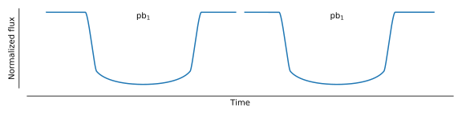
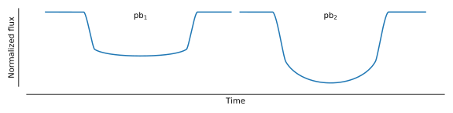
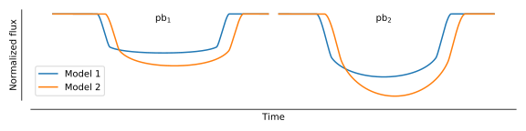

PyTransit
=========

PyTransit is a package for exoplanet transit light curve modelling. It offers optimised CPU and
GPU implementations of exoplanet transit models behind a unified interface. Evaluating a model is
trivial for simple cases, such as a homogeneous light curve observed in a single passband, and
stays straightforward for complex ones, such as *heterogeneous light curves containing transits
observed in different passbands with different instruments*, or *transmission spectroscopy*.

Development began in 2009 to fill the need for a fast and reliable exoplanet transit modelling
toolkit for Python. PyTransit has since gone through several iterations, always aiming to be *the
fastest and most versatile* exoplanet transit modelling tool for Python.

.. grid:: 2
    :gutter: 3

    .. grid-item-card:: Getting started
        :link: installation
        :link-type: doc

        Install PyTransit and evaluate your first transit model.

    .. grid-item-card:: User guide
        :link: guide/index
        :link-type: doc

        The model interface, data setup, evaluation, limb darkening, and the OpenCL backend.

    .. grid-item-card:: Transit models
        :link: models/index
        :link-type: doc

        The model catalogue: what each model does, when to use it, and its full API.

    .. grid-item-card:: API reference
        :link: api/index
        :link-type: doc

        The transit model base class, limb darkening laws, stellar spectra, contamination, and I/O.

A first example
---------------

Model initialisation is straightforward. At its simplest, the model needs only an array of
mid-exposure times

.. code-block:: python

    from pytransit import RoadRunnerModel

    tm = RoadRunnerModel('quadratic')
    tm.set_data(times)

after which it is ready to be evaluated

.. code-block:: python

    tm.evaluate(k=0.1, ldc=[0.2, 0.1], t0=0.0, p=1.0, a=3.0, i=0.5*pi)

To complicate things a little, consider modelling several transits observed in different
passbands. Stellar limb darkening varies from passband to passband, so we need a set of limb
darkening coefficients for each passband, and we may also want the radius ratio to vary between
passbands. We initialise the model with per-exposure light curve indices (`lcids`) and
per-light-curve passband indices (`pbids`) -- both simple integer arrays -- after which the model
can be evaluated with a passband-dependent radius ratio and limb darkening

.. code-block:: python

    tm.set_data(times, lcids=lcids, pbids=pbids)
    tm.evaluate(k=[0.10, 0.12], ldc=[[0.2, 0.1, 0.5, 0.1]], t0=0.0, p=1.0, a=3.0, i=0.5*pi)

We made both the radius ratio and the limb darkening passband-dependent above, but we could just
as well have passed a single scalar radius ratio, in which case only the limb darkening would vary
between passbands.

We often want to evaluate the model for a large set of parameters at once, such as when sampling
with *emcee* or using any other population-based sampler or optimiser. Give `evaluate` an array of
parameters

.. code-block:: python

    tm.evaluate(k=[[0.10, 0.12], [0.11, 0.13]],
                ldc=[[0.2, 0.1, 0.5, 0.1],[0.4, 0.2, 0.75, 0.1]],
                t0=[0.0, 0.01], p=[1, 1], a=[3.0, 2.9], i=[.5*pi, .5*pi])

and PyTransit calculates the models for the whole parameter set in parallel.

Citing PyTransit
----------------

If PyTransit contributes to a publication, please cite Parviainen (MNRAS 450, 3233, 2015). The
individual models carry their own references, listed on each model's page under
:doc:`models/index`.

Contents
--------

.. toctree::
    :maxdepth: 2
    :caption: Getting started

    installation
    highlights
    notebooks/quickstart

.. toctree::
    :maxdepth: 2
    :caption: User guide

    guide/index

.. toctree::
    :maxdepth: 2
    :caption: Transit models

    models/index

.. toctree::
    :maxdepth: 2
    :caption: Supporting modules

    stars
    contamination
    io

.. toctree::
    :maxdepth: 2
    :caption: Reference

    api/index

Indices and tables
==================

* :ref:`genindex`
* :ref:`modindex`
* :ref:`search`
